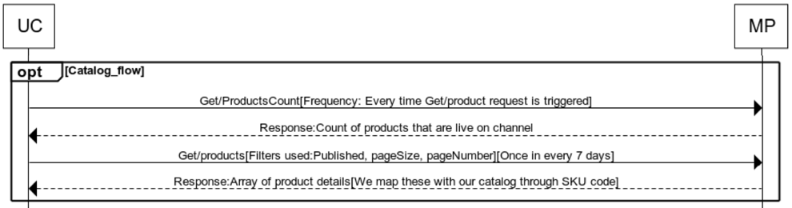

## Flow

## Get Product Count

- Get/ProductsCount – To get current count of products at marketplace.
-  Uniware sends the request to get the current count of both published and un-published products from the marketplace. Separate requests are sent for both published and un-published product, by setting the publishedStatus query parameter.
-  The marketplace sends back the count for queried products.

## Get Products

- Get/products – To get list of products at marketplace based on predefined filters. This request is initiated automatically every 7 days.
- Filters are:
    - pageNumber
    - pageSize
    - skus
    - publishedStatus
-  Uniware requests the products from the marketplace, based on some predefined filters, every 7 days to match it with the product list in uniware.
-  The marketplace sends back the product list for queried products. 
