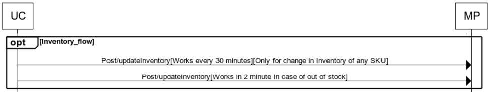

Uniware posts the updated inventory information on marketplace, on following occasions:
-	Post/updateInventory – Every 30 minutes to post any inventory changes done on Uniware.
-	Post/updateInventory – Every 2 minutes to post any inventory going out-of-stock on Uniware.

## Flow

