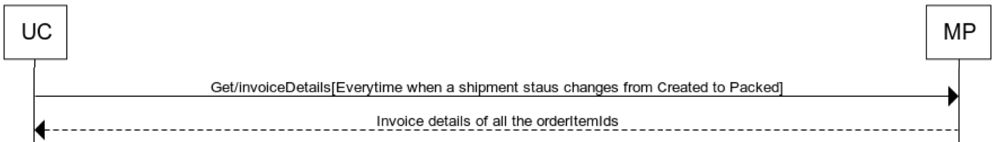

Get/InvoiceDetails - Uniware fetches the invoice details from the marketplace once the shipment status changes form ‘Created’ to ‘Packed’.

## Flow

## Summary

1.	Uniware queries the marketplace for the invoice details against an orderId, once it’s status is packed on uniware.
2.	Marketplace responds with the invoice details for the particular orderId.

