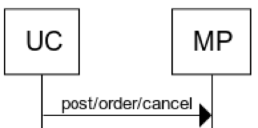

In case cancellation update required by the client, following is the method to achieve the update. 

## Flow

Post/order/cancel - On cancellation of order by seller, the updated order status is posted on the marketplace.

