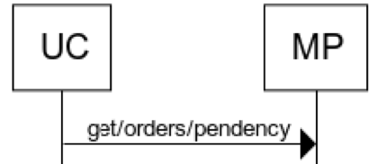

Get/orders/pendency - In cases where the partner requires the seller to block the inventory for orders received and process them upon receiving confirmation. Such orders are fetched as on-hold orders for blocking the inventor.

## Flow

