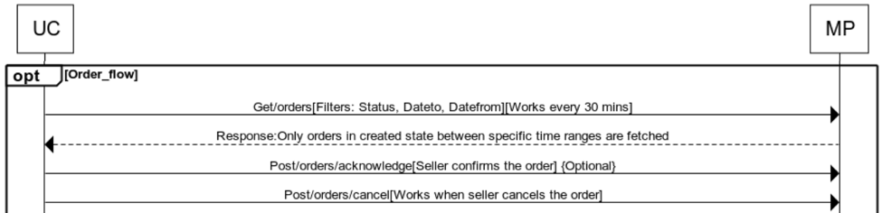

Uniware interacts with marketplace for following order information:
-	Get/orders – To get list of orders at marketplace based on predefined filters. This request is initiated automatically every 30 mins.
-	Filters - 
    -	pageNumber
    -	pageSize
    -	orderIds
    -	orderItemIds
    -	orderDateFrom
    -	orderDateTo
    -	orderStatus
-	Post/orders/acknowledge – Once a seller acknowledges an order. Uniware posts the acknowledgment information on marketplace.
-	Post/orders/cancel – Once a seller cancels an order. Uniware posts the cancellation information on marketplace.

## Flow

## Summary

1.	Uniware sends the request to get the list of orders on marketplace, filtered on some predefined parameters, generally Status, Dateto and Datefrom.
2.	The marketplace sends back the order list for queried orders.
3.	Sometimes, a client requires the vendor to acknowledge the received order (as an additional step) as a confirmation to fulfillment. In such cases, when the vendor acknowledges an order on uniware interface, the information for the same is posted on the marketplace.
4.	If a vendor cancels an order(s), the information for the same is posted on the marketplace.

