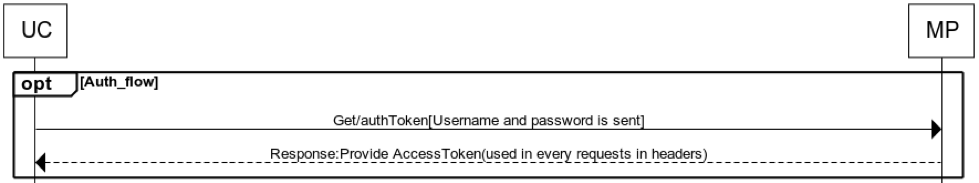

The Uniware works on token based authentication, in which valid auth. token is sent with each API request. This auth. token is expected from marketplace against valid user credentials.

## Flow

## Summary

1. Uniware sends the valid username and password.
2. If the username and password is valid, marketplace issues a auth. token.
3. This auth. token should be sent with each request by the Uniware.
